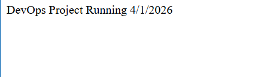

* (SIMPLE UI AND FOCUSING ON THE ARCHITECTURE OF BUILDING AS DEVOPS ENGINEER)

DevOps Project 1 --Simple Node.js App
****************************************
This is my first DevOps project where I built a simple Node.js application and automated its
deployment using Docker, GitHub Actions, and AWS EC2.

Steps
********
1) Built so simple Node.js app
2) Dockerized the application
3) Pushed code to GitHub
4) Created a CI/CD pipeline using GitHub Actions
5) Built and pushed Docker image to Docker Hub
6) Deployed the app automatically to AWS EC2 using SSH

How it works
****************
When I push code to GitHub:
GitHub Actions builds the Docker image
Logs into Docker Hub
Pushes the image
Connects to EC2 using SSH
Pulls and runs the container

This project helped me gain hands-on experience with CI/CD pipelines, Docker containers,
Debugging real DevOps issues and handling secrets securely.

UI Preview
************

